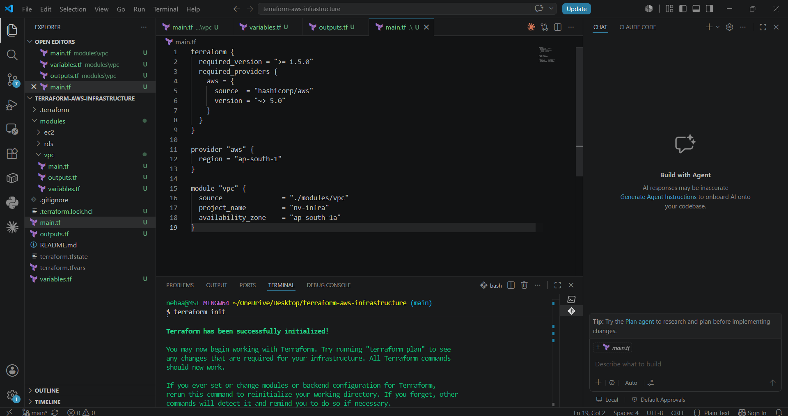
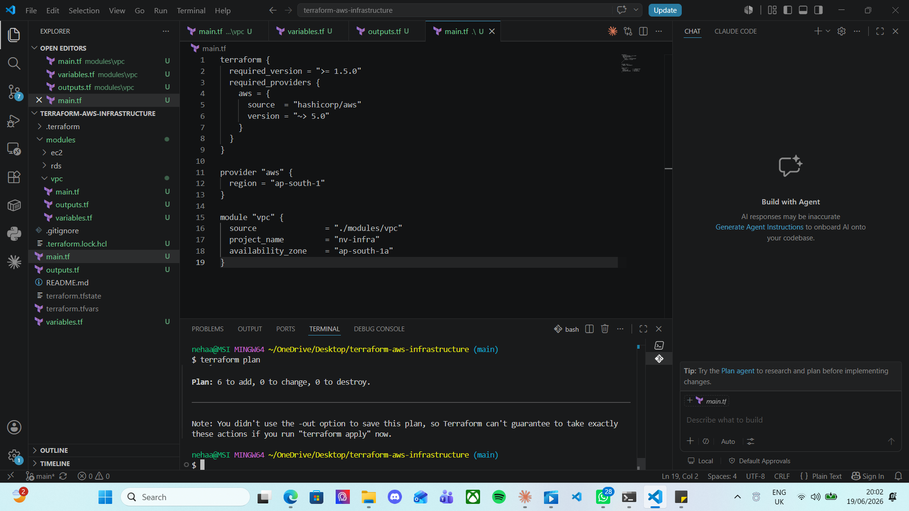
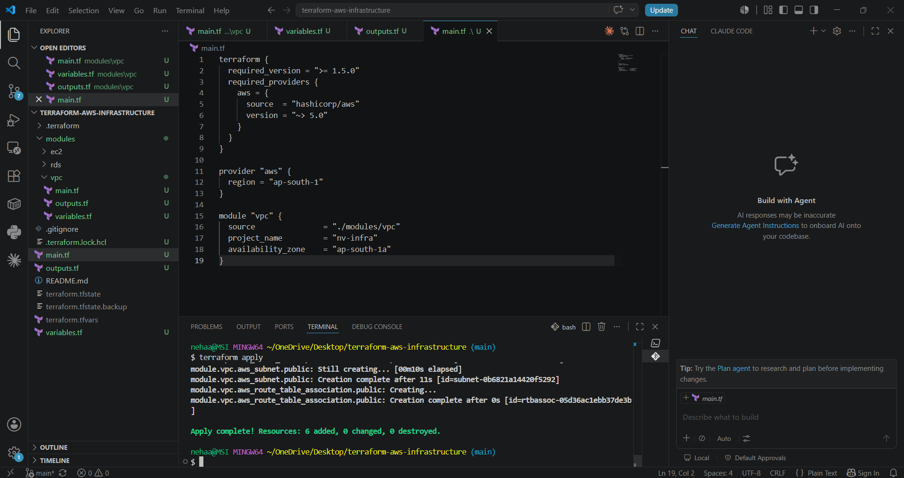
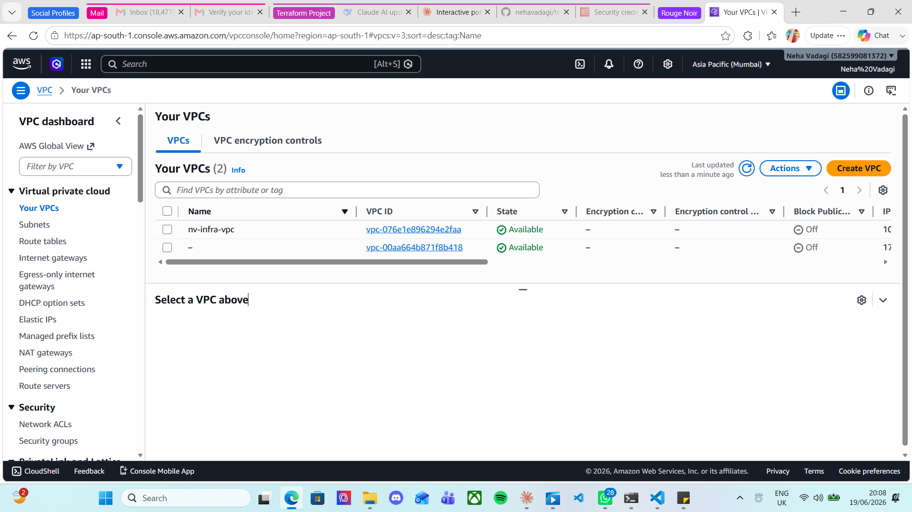
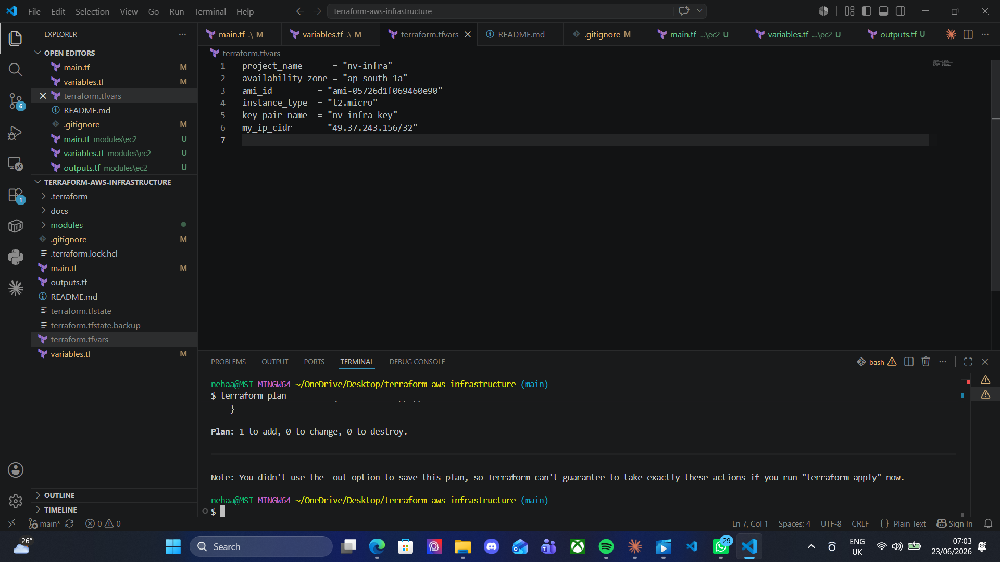
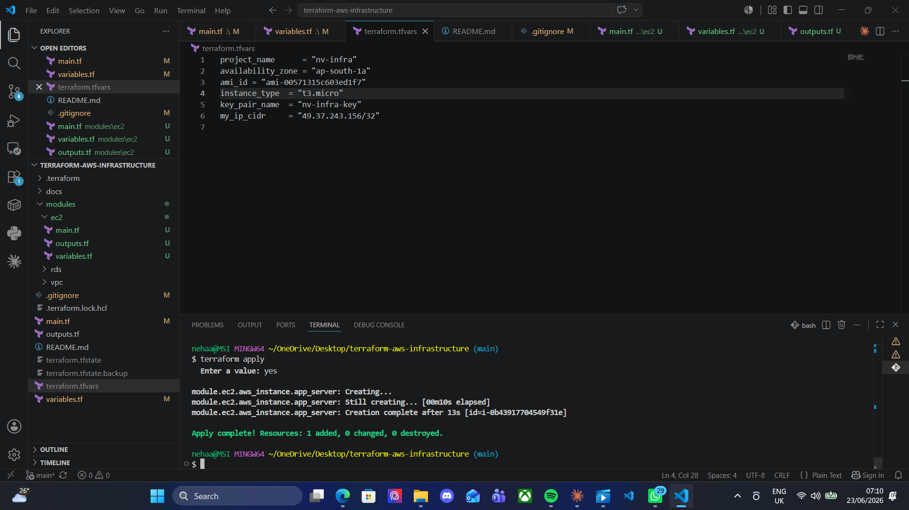
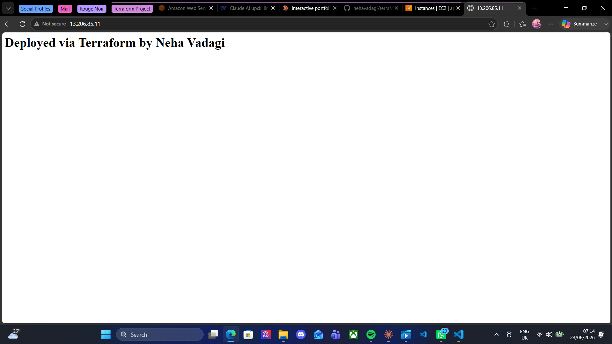

# AWS Infrastructure Automation with Terraform

A multi-tier AWS infrastructure project built with Terraform, demonstrating Infrastructure as Code (IaC) principles — VPC networking, EC2 compute, and RDS database provisioning, fully modularized and version-controlled.

Built as a hands-on learning project to move from cloud incident management into infrastructure engineering — every module here was written, planned, applied, and verified manually before moving to the next.

---

## Architecture Overview

```
                        ┌─────────────────────────────────────┐
                        │              VPC (10.0.0.0/16)        │
                        │                                        │
                        │   ┌───────────────┐  ┌──────────────┐ │
   Internet ── IGW ─────┼──▶│ Public Subnet  │  │Private Subnet│ │
                        │   │  10.0.1.0/24   │  │ 10.0.2.0/24  │ │
                        │   │                │  │              │ │
                        │   │  ┌──────────┐  │  │ ┌──────────┐ │ │
                        │   │  │ EC2      │  │  │ │ RDS      │ │ │
                        │   │  │ Instance │──┼──┼▶│ MySQL    │ │ │
                        │   │  └──────────┘  │  │ └──────────┘ │ │
                        │   └───────────────┘  └──────────────┘ │
                        └─────────────────────────────────────┘
```
*(Will be replaced with a proper visual architecture diagram once the RDS module is complete)*

---

## Tech Stack

- **Terraform** — Infrastructure as Code
- **AWS** — VPC, EC2, RDS
- **AWS CLI** — authentication and resource verification
- **Git / GitHub** — version control
- **VS Code** — development environment, with HashiCorp Terraform extension

---

## Prerequisites

- AWS account with an IAM user (not root) configured with programmatic access
- AWS CLI v2 installed and configured (`aws configure`)
- Terraform >= 1.5.0
- VS Code with the **HashiCorp Terraform** extension installed
- An EC2 key pair (for SSH access)
- Git

---

## Project Structure

```
terraform-aws-infrastructure/
├── main.tf                  # Root module — wires all child modules together
├── variables.tf              # Root-level input variables
├── outputs.tf                # Root-level outputs
├── terraform.tfvars           # Actual variable values (gitignored)
├── .gitignore
├── modules/
│   ├── vpc/
│   │   ├── main.tf
│   │   ├── variables.tf
│   │   └── outputs.tf
│   ├── ec2/
│   │   ├── main.tf
│   │   ├── variables.tf
│   │   └── outputs.tf
│   └── rds/
│       ├── main.tf
│       ├── variables.tf
│       └── outputs.tf
└── docs/
    └── screenshots/
```

---

## Module 1: VPC — Networking Foundation ✅

**What it builds:** A custom VPC with one public subnet (internet-facing) and one private subnet (internal-only), connected via an Internet Gateway and a route table.

**Why this design:** Public/private subnet separation is a core AWS security pattern. Internet-facing resources (like the EC2 web server) sit in the public subnet, while sensitive resources (like the RDS database) stay isolated in the private subnet with no direct internet exposure — following the principle of least privilege at the network level.

**Resources created:**
- 1 VPC (`10.0.0.0/16`)
- 1 public subnet (`10.0.1.0/24`)
- 1 private subnet (`10.0.2.0/24`)
- 1 Internet Gateway
- 1 public route table + association

### Steps taken

1. Configured AWS CLI with IAM credentials and verified authentication
2. Wrote `modules/vpc/main.tf`, `variables.tf`, `outputs.tf`
3. Wired the VPC module into the root `main.tf`
4. Ran `terraform init` to download and initialize the AWS provider plugin
5. Ran `terraform plan` to preview the 6 resources before creating anything in AWS
6. Ran `terraform apply` to provision the VPC, subnets, Internet Gateway, and route table
7. Verified the created resources directly in the AWS Console (`ap-south-1` / Mumbai region)

### Screenshots

**AWS CLI authenticated and initialized:**



**`terraform plan` — dry run showing exactly what will be created before touching AWS:**



**`terraform apply` — resources actually created in AWS:**



**AWS Console verification — `nv-infra-vpc` live in `ap-south-1`:**



---

## Module 2: EC2 — Compute Layer ✅

**What it builds:** A security group enforcing least-privilege firewall rules, plus an EC2 instance placed in the public subnet. The instance uses a `user_data` bootstrap script to automatically install and start a web server on first boot — no manual SSH login required to get it running.

**Why this design:**
- The security group only allows **SSH (port 22) from a single trusted IP** — not the entire internet (`0.0.0.0/0`) — while **HTTP (port 80) is open publicly**, since this is meant to be a reachable website.
- The bootstrap script demonstrates the core DevOps principle of **immutable, automated provisioning** — the server configures itself identically every time, with zero manual intervention.

**Resources created:**
- 1 security group (`nv-infra-ec2-sg`) — SSH restricted to one IP, HTTP open, all outbound allowed
- 1 EC2 instance (`nv-infra-app-server`) — Amazon Linux 2023, running Apache (`httpd`)

### Steps taken

1. Created an EC2 key pair (`nv-infra-key`) in the AWS Console for SSH access
2. Retrieved my IP address to scope the SSH rule to a single trusted source
3. Looked up a valid Amazon Linux 2023 AMI ID for `ap-south-1` using the AWS CLI
4. Wrote `modules/ec2/main.tf`, `variables.tf`, `outputs.tf`
5. Wired the EC2 module into root `main.tf`, referencing the VPC module's outputs (`vpc_id`, `public_subnet_id`)
6. Ran `terraform plan` / `terraform apply`
7. Debugged a real-world AWS account-specific issue (documented below)
8. Verified the live web server by visiting the instance's public IP in a browser
9. Added root-level `outputs.tf` to expose the EC2 public IP and instance ID directly via `terraform output`, instead of manually checking the AWS Console

### Real debugging story: Free Tier instance type mismatch

While running `terraform apply`, AWS rejected the EC2 instance creation with:
```
InvalidParameterCombination: The specified instance type is not eligible for Free Tier.
```

**Root cause:** the `t2.micro` instance type — the "default" free-tier example used in most tutorials — was not actually on *this* AWS account's free-tier eligible list. Newer AWS accounts have shifted free-tier eligibility toward the `t3`/`t4g` instance family instead of `t2`.

**How I diagnosed it:**
```bash
aws ec2 describe-instance-types --filters "Name=free-tier-eligible,Values=true" --query "InstanceTypes[*].InstanceType" --output table
```
This returned `t3.micro`, `t3.small`, `t4g.micro`, `t4g.small` — but **not** `t2.micro` — for my account.

**Fix:** switched `instance_type` to `t3.micro` in `terraform.tfvars`. I also had to switch the AMI from an older Amazon Linux 2 image to a standard **Amazon Linux 2023** image, which in turn required updating the `user_data` script from `yum` (AL2's package manager) to `dnf` (AL2023's package manager) — a good reminder that infrastructure code is tightly coupled to the OS image it's provisioning.

**Lesson:** never assume tutorial defaults match your account's actual configuration — always verify against the AWS API directly rather than trusting older guides or default values.

### Screenshots

**`terraform plan` after the fix — corrected instance type:**



**`terraform apply` — EC2 instance successfully created:**



**Live website — proof the full chain (Terraform → AWS → running web server) works end to end:**



**Root-level Terraform outputs — public IP and instance ID available via CLI, no console digging required:**


---

## Module 3: RDS — Database Layer ⏳
*(in progress)*

**What it will build:** A MySQL database instance inside the private subnet, with a security group that only trusts inbound traffic from the EC2 instance's security group — never directly from the internet, and never from my own IP either.

---

## Key Terraform Concepts Demonstrated

- **Modular infrastructure design** — each layer (VPC, EC2, RDS) is a self-contained, reusable module
- **Variables and outputs** — modules communicate via declared inputs/outputs rather than hardcoded values, the same way functions pass parameters and return values
- **Implicit dependency resolution** — Terraform automatically determines build order (e.g. VPC before subnets, subnets before EC2) based on resource references, without manual sequencing
- **Plan-before-apply workflow** — every change is previewed with `terraform plan` before being applied, preventing unintended infrastructure changes
- **Security best practices** — private subnet isolation for databases, least-privilege security group rules (SSH locked to a single IP, RDS locked to a security group reference rather than an IP range)
- **State management** — Terraform's state file tracks real-world resource mapping, excluded from version control via `.gitignore` since it can contain sensitive values
- **Bootstrapping / automated provisioning** — using `user_data` to configure a server automatically on boot, rather than manual post-launch setup
- **Environment-specific debugging** — diagnosing and resolving an account-specific AWS Free Tier eligibility mismatch using the AWS CLI directly, rather than trusting default tutorial values

---

## What I Learned

- How Terraform's plan → apply workflow protects against unintended changes, and why `plan` should be treated as a mandatory checkpoint, not an optional step
- Why infrastructure code must match its target OS image exactly (AMI generation vs. package manager — `yum` vs `dnf`) — a mismatch here doesn't error loudly, it fails silently inside `user_data`
- That AWS Free Tier eligibility isn't a fixed global list — it varies by account, and the only reliable way to check is by querying the AWS API directly (`describe-instance-types`) rather than trusting tutorials
- How security groups can reference *other security groups* (not just IP ranges) to create tightly scoped trust relationships — this is how the RDS database will only trust the EC2 instance, and nothing else
- Practical Git workflow habits for infrastructure-as-code: committing after each verified module, keeping `.gitignore` strict from day one to avoid ever committing state files or secrets

*(more to be added once the RDS module is complete)*

---

## Author

**Neha Vadagi**
Cloud Operations Engineer | [LinkedIn](https://www.linkedin.com/in/neha-vadagi-9616731b3/) | [GitHub](https://github.com/nehavadagi)